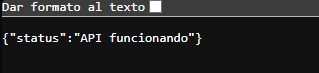
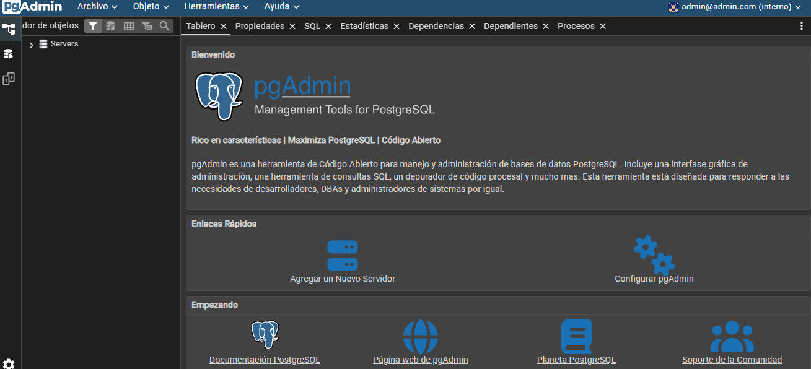
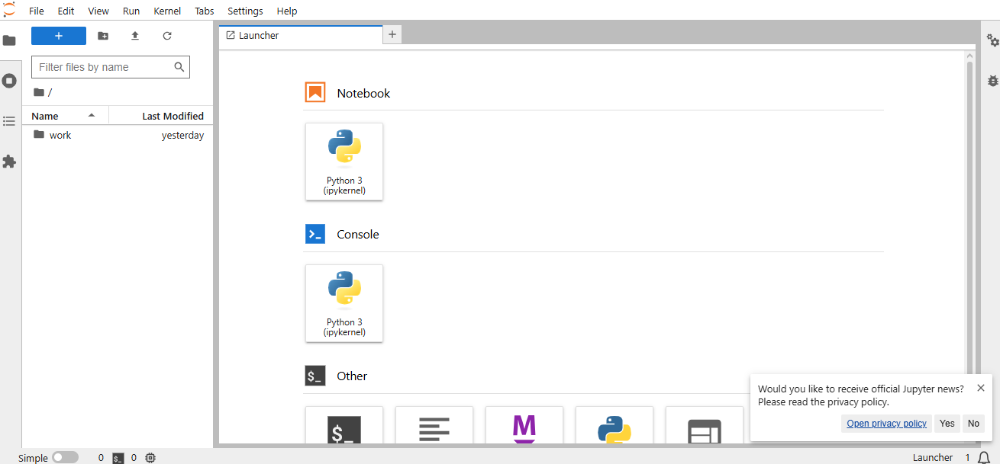
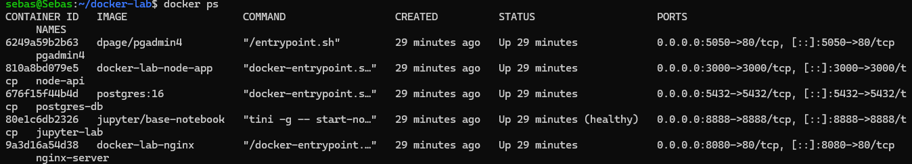

# Docker Lab con WSL2 y Ubuntu

## Este proyecto implementa un entorno de desarrollo basado en contenedores Docker utilizando WSL2 y Ubuntu sobre Windows.

## Tecnologías Utilizadas

- WSL2
- Ubuntu
- Docker
- Nginx
- Node.js
- PostgreSQL
- pgAdmin 4
- Jupyter Lab
- Git & GitHub

---

# Arquitectura del Proyecto

text
Windows
│
├── WSL2
│   └── Ubuntu
│
└── Docker Compose
    ├── nginx
    ├── node-app
    ├── postgres
    ├── pgadmin
    └── jupyter

---

# Estructura del Proyecto

text
docker-lab/
│
├── nginx/
├── node-app/
├── postgres/
├── jupyter/
├── .env
├── docker-compose.yml
└── README.md

---

# Instalación

## Clonar repositorio

bash
git clone URL_DEL_REPOSITORIO

## Entrar al proyecto

bash
cd docker-lab

## Levantar contenedores

bash
docker compose up -d

# Servicios

| Servicio | Puerto |
|---|---|
| Nginx | 8080 |
| Node.js | 3000 |
| PostgreSQL | 5432 |
| pgAdmin | 5050 |
| Jupyter | 8888 |

---

# Evidencias

## Nginx funcionando                      
 
## API Node.js

## pgAdmin

## Jupyter Lab

## contenedores activos

---

# Intregantes de grupo

| Nombre | Codigo |
|---|---|
|  Adriana Milena Noscue Dagua | 2477336 |
| Sebastian Cucalon Astorquiza | 2477344 |
